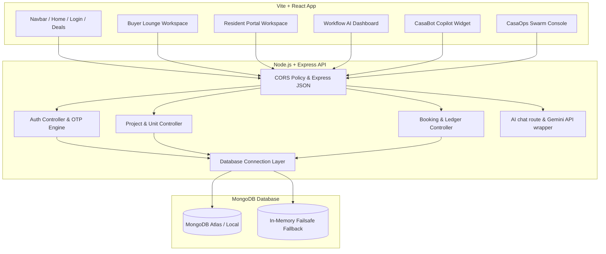

# CasaEstate — Autonomous Workflow & Real Estate Copilot Platform

CasaEstate (formerly BuildFlow AI) is a secure, role-based, full-stack real estate platform designed to orchestrate multi-department workflows, automate compliance audits, and streamline operations between builders, site engineers, buyers, and residents.

---

## 📌 Problem Statement
In traditional real estate development and management:
1. **Inefficient Multi-Department Workflows**: Operations, accounting, legal compliance, and field engineering lack a unified system to automate handshakes, verify inspections, and trigger event chains.
2. **Opacity for Buyers**: Prospective buyers lack visibility into live construction updates, structural benchmarks, and actual scheduling/procurement risks.
3. **Frictional Resident Management**: Resident owners face fragmented systems for RWA amenity bookings, maintenance billing dues, and grievance logging.
4. **Weak Auditing & Compliance**: Digital registries, RERA permits, and invoice vaults are kept in silos rather than updated against real-time project milestones.

---

## 💡 The Solution
CasaEstate solves these operational challenges by introducing a unified, secure dashboard hosting:
*   **CasaOps Multi-Agent Swarm Console**: A collaborative, three-part agent loop executing operations checks (Agent Alpha), predictive risk modeling (Agent Beta), and document compilation (Agent Gamma).
*   **Role-Based Access Gateway**: Secure login via email or phone verification (with country code selector dropdowns) routing users instantly to custom landing spaces.
*   **Interactive Deals Viewport**: A responsive media engine replacing static toggles with horizontal interior/exterior swiping carousels.
*   **Integrated Action Portals**:
    *   **Buyer Lounge**: Interactive build updates, Recharts scheduling predictions, and document compliance vaults.
    *   **Resident Portal**: Society amenity slot allocations, billing ledgers, and grievance tickets.
*   **CasaBot Widget**: A fixed, bottom-right copilot widget with strict layer visibility (`z-[9999]`) and custom keyword fallback matrix for offline operation.

---

## 🏗️ System Architecture



---

## 🛠️ Technology Stack

### Frontend
*   **Core framework**: React 18, Vite (fast HMR bundling)
*   **Styling**: Vanilla CSS + Tailwind CSS (premium minimalist, high-contrast dark theme presets)
*   **Interactive Charts**: Recharts (dynamic delay curves, procurement cost variance bars)
*   **Routing**: React Router DOM (protected layout gates)
*   **HTTP client**: Axios (custom request interceptors attaching JWT session tokens)

### Backend
*   **Runtime environment**: Node.js
*   **Server framework**: Express.js
*   **Database ODM**: Mongoose (MongoDB connection lifecycle)
*   **Authentication**: JSON Web Tokens (JWT) + OTP verification codes
*   **API integration**: Native Fetch API communicating with Google Generative AI (Gemini 1.5 Flash models)

---

## 🔄 Core Workflow & Working Principle

### 1. Unified Authentication Gate
*   The gateway in `Login.jsx` allows users to select between **Buyer Lounge** and **Resident Portal** tracks.
*   Supports toggling between Email and Phone Number input.
*   Phone inputs prepend a flag selector dropdown listing global dial codes (🇮🇳 +91, 🇺🇸 +1, 🇬🇧 +44, 🇦🇪 +971, 🇸🇬 +65) defaulting to India (+91).
*   Upon requesting OTP, backend generates a secure 6-digit passcode. In production, this pass is sent out to the user's primary contact details, and in guest bypass mode, the master code `123456` handles sign-ins safely.

### 2. Intelligent Role Redirects
Upon success, the token is saved to localStorage, and users are routed to their designated landing spaces:
*   **Buyers** landing path: `/buyer-lounge` (instantiates ClientProgressPortal layout).
*   **Residents** landing path: `/resident-portal` (instantiates ResidentPortal layout).
*   **Admins** landing path: `/admin` (instantiates AdminDashboard cockpit).

### 3. The Multi-Agent Swarm Execution Loop
Within the Workflow AI sections, the **CasaOps Swarm Console** models the handshake:
```
[Agent Alpha] (Operations) ────► Telemetry field checks on rebar, steel, concrete slump
       │
       ▼
[Agent Beta]  (Analytics)  ────► Triggers delay curve predictions & cost variance recalculations
       │
       ▼
[Agent Gamma] (Narrative)  ────► Compiles RERA certificates & compiles client PDF invoices
```
*   Clicking **"⚡ Run Swarm Audit"** triggers this pipeline.
*   Once approved, the database updates the target construction stage (e.g. from "Pending Slab Casting" to "Active Curing Phase") and drops the fresh compliance letter into the user's invoice vault.

---

## 💎 Key Functionalities & Features

### 1. Deals Room Horizontal Swipe
*   Replaces outdated layout pickers with an horizontal swipe carousel.
*   Includes pagination view indicators (e.g. `VIEW 1 / 3`) colored in high-contrast white.
*   Allows potential buyers to preview layout blueprints in real time and schedule on-site viewings.

### 2. RWA Resident Desk
*   **Amenity Bookings**: Allows booking slots for tennis courts, gyms, and the clubhouse, verifying slot capacity limits dynamically.
*   **Ledgers & Dues**: Displays paid and pending dues on a ledger table. Includes payment gates to pay pending dues securely.
*   **Grievances**: Allows residents to file tickets which are automatically assigned to the facility head with a 24-hour SLA.

### 3. CasaBot Widget Copilot
*   Accessible from any page via a floating action trigger.
*   Sits at `z-[9999]` preventing overlap with dropdown menus or map grids.
*   Utilizes a local keyword semantic matrix matching queries against:
    *   *Delay/timeline*: Noida Tower A vs. Tower B variance.
    *   *RERA/compliance*: Noida, Gurugram, and Mumbai RERA numbers.
    *   *Material/curing*: Slump tests, concrete density, and rebar details.
    *   *Costs*: positive cost variances and budget optimization numbers.

---

## 📂 File Directory Mapping

*   **API Interceptor & Methods**: [`frontend/src/services/api.js`](file:///C:/Users/kumar/.gemini/antigravity/scratch/aura-estates/frontend/src/services/api.js)
*   **Dynamic Navigation Tabs**: [`frontend/src/components/Navbar.jsx`](file:///C:/Users/kumar/.gemini/antigravity/scratch/aura-estates/frontend/src/components/Navbar.jsx)
*   **Access gateway & dial codes**: [`frontend/src/pages/Login.jsx`](file:///C:/Users/kumar/.gemini/antigravity/scratch/aura-estates/frontend/src/pages/Login.jsx)
*   **Deals Viewport Swipe Carousel**: [`frontend/src/pages/Deals.jsx`](file:///C:/Users/kumar/.gemini/antigravity/scratch/aura-estates/frontend/src/pages/Deals.jsx)
*   **Buyer lounge workspace**: [`frontend/src/pages/ClientProgressPortal.jsx`](file:///C:/Users/kumar/.gemini/antigravity/scratch/aura-estates/frontend/src/pages/ClientProgressPortal.jsx)
*   **Resident Portal workspace**: [`frontend/src/pages/ResidentPortal.jsx`](file:///C:/Users/kumar/.gemini/antigravity/scratch/aura-estates/frontend/src/pages/ResidentPortal.jsx)
*   **Multi-Agent Swarm Console**: [`frontend/src/components/CasaOpsSwarmConsole.jsx`](file:///C:/Users/kumar/.gemini/antigravity/scratch/aura-estates/frontend/src/components/CasaOpsSwarmConsole.jsx)
*   **Standalone workflow dashboard**: [`frontend/src/pages/WorkflowDashboard.jsx`](file:///C:/Users/kumar/.gemini/antigravity/scratch/aura-estates/frontend/src/pages/WorkflowDashboard.jsx)
*   **CasaBot widget layers**: [`frontend/src/components/CasaBotWidget.jsx`](file:///C:/Users/kumar/.gemini/antigravity/scratch/aura-estates/frontend/src/components/CasaBotWidget.jsx)
*   **CORS & Express Server**: [`backend/server.js`](file:///C:/Users/kumar/.gemini/antigravity/scratch/aura-estates/backend/server.js)
*   **Offline semantic chatbot routes**: [`backend/src/routes/aiRoutes.js`](file:///C:/Users/kumar/.gemini/antigravity/scratch/aura-estates/backend/src/routes/aiRoutes.js)
