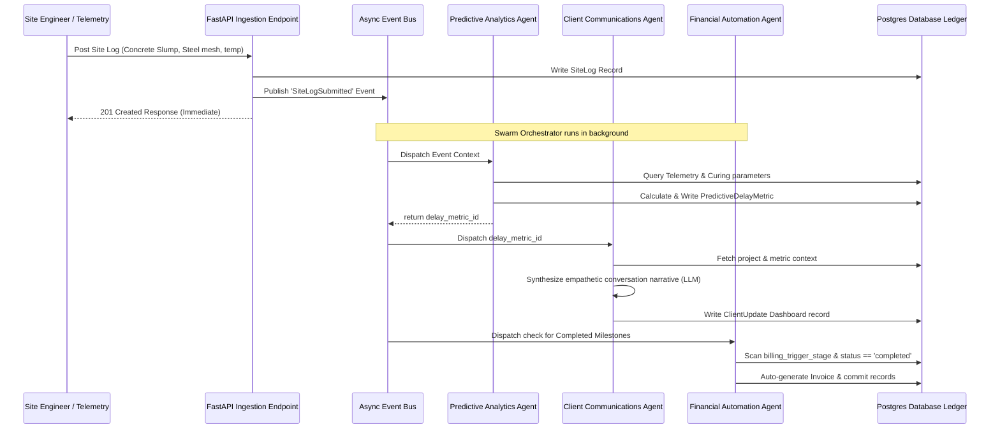

# CasaEstate AI — Event-Driven Automation Backend

This directory contains the production-ready Python backend architecture for **CasaEstate AI**, an event-driven automation platform for construction and real estate operations.

---

## 🏗️ Architecture Design

The backend uses a reactive, event-driven pattern designed around an asynchronous event broker and specialized AI agents:



---

## 📁 File Structure

*   [database.py](file:///C:/Users/kumar/.gemini/antigravity/scratch/aura-estates/casa_ai_backend/database.py): Contains the database connection engine and declarative SQLAlchemy models tracking Projects, Milestones, SiteLogs, PredictiveDelayMetrics, ClientUpdates, and Invoices.
*   [schemas.py](file:///C:/Users/kumar/.gemini/antigravity/scratch/aura-estates/casa_ai_backend/schemas.py): Contains Pydantic models for data validation, transfer schemas, and custom event payloads.
*   [agents.py](file:///C:/Users/kumar/.gemini/antigravity/scratch/aura-estates/casa_ai_backend/agents.py): Contains modular, production-grade classes for:
    1.  `PredictiveAnalyticsAgent`: Telemetry-based timeline deviation regression modeling.
    2.  `ClientCommunicationsAgent`: Conversational template/LLM narrative synthesizer.
    3.  `FinancialInvoiceAgent`: Programmatic billing generator linked directly to milestone achievements.
*   [event_bus.py](file:///C:/Users/kumar/.gemini/antigravity/scratch/aura-estates/casa_ai_backend/event_bus.py): An asynchronous, in-memory event orchestrator implementing pub-sub handlers.
*   [main.py](file:///C:/Users/kumar/.gemini/antigravity/scratch/aura-estates/casa_ai_backend/main.py): Entry FastAPI application exposing routes to submit telemetry logs, query analytics, and seed testing setups.

---

## 🚀 Setting Up & Running the Application

### 1. Requirements
Ensure you have Python 3.9+ and pip installed.

### 2. Install dependencies
```bash
pip install fastapi uvicorn sqlalchemy psycopg2-binary pydantic
```

### 3. Database configuration
Update the `DATABASE_URL` connection string inside [database.py](file:///C:/Users/kumar/.gemini/antigravity/scratch/aura-estates/casa_ai_backend/database.py) with your PostgreSQL credentials:
```python
DATABASE_URL = "postgresql+psycopg2://<username>:<password>@localhost:5432/<database_name>"
```

### 4. Running the Dev Server
From the `casa_ai_backend` folder, execute:
```bash
uvicorn main:app --reload
```

### 5. Seed Sandbox Records
Use the built-in seed helper to populate initial projects and milestone triggers in your database:
```bash
curl -X POST http://localhost:8000/api/v1/seed
```

### 6. Submitting Site logs (Triggers AI Swarm Pipeline)
Simulate a Site Engineer log submission to watch the agents execute in real time on the console logs:
```bash
curl -X POST http://localhost:8000/api/v1/site-logs \
  -H "Content-Type: application/json" \
  -d '{"project_id": 1, "concrete_slump_value": 75.0, "steel_reinforcement_mesh_ok": false, "formwork_approved": true, "curing_temperature_celsius": 38.0, "notes": "Casting test under hot sun."}'
```
Check the terminal uvicorn logs to see the sequential agent execution trace!
